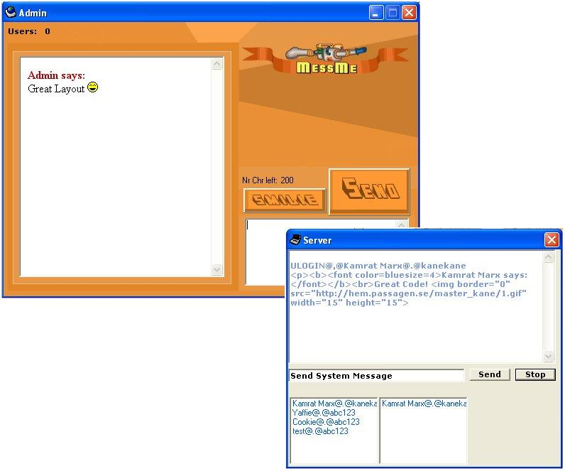



## MessMe

### Description

This is a small community instant messenger, I know there is sooooo many of them on psc but... this one is a bit different... it’s Server/client based with an multi-connection ability that allows up to two hundred peers to be connected to the server! (I downloaded the server/client from psc but forgot who made it... so if anyone recognizes the code... just let me know and ill give u some creeds in the code) It has animated smiles like yahoo and a login form that is controlled by the server... And it looks so sweeeet to =D (vote/comment)
 
### More Info
 

             |
---                |---
**Submitted On**   |2003-02-13 19:47:40
**By**             |[Jonathan Rossing](https://github.com/Planet-Source-Code/PSCIndex/blob/master/ByAuthor/jonathan-rossing.md)
**Level**          |Intermediate
**User Rating**    |4.2 (21 globes from 5 users)
**Compatibility**  |VB 6\.0
**Category**       |[Internet/ HTML](https://github.com/Planet-Source-Code/PSCIndex/blob/master/ByCategory/internet-html__1-34.md)
**World**          |[Visual Basic](https://github.com/Planet-Source-Code/PSCIndex/blob/master/ByWorld/visual-basic.md)
**Archive File**   |[MessMe1558563132003\.zip](https://github.com/Planet-Source-Code/jonathan-rossing-messme__1-43970/archive/master.zip)

